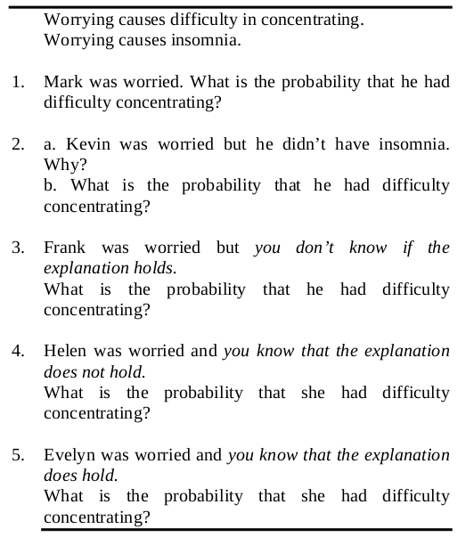

## Introduction

I would like to replicate Walsh & Sloman (2004), Experiment 2.

I'm interested in doing research on explanation and representation of causal relationships. I didn't see a lot of relevant papers in Psychological Science (2015). There was one neuro paper on what areas of the brain are involved in social explanation and several papers that elicited coarse information about people's lay theories of various domains that didn't seem particularly helpful to me. I have a secondary project from Psych Science that I could do if I have extra time and energy (see ).

Walsh & Sloman (2004) in their Experiment 2 elicit explanations from participants and use the elicited explanations to ask about probability judgments.

### Description of experiment

Walsh & Sloman (2004) in their Experiment 2 give participants an instance in which a causal event that usually results in a parituclar effect for some reason doesn't. They asked participants to explain why this apparent contradiction occurred. They showed that participants thought other consequences were also less likely to result from the causal event. When they were told about a different situation, in which the explanation they provided held, they gave the same probability for the consequent. When whether or not the explanation held was unknown, participants gave low probabilities, but when the explanation definitely did not hold, their judgements were back to the default levels, without any contradictory evidence.

### Challenges

In the original, they had an experimenter, who could accurately echo back the explanation a participant gave and its negation. That might be a little bit difficult to automate, but I'd like to be able to automate simple such echoing interactions with participants for my future work.

### Example questions

